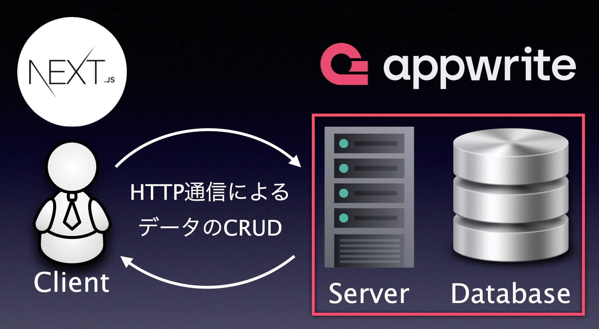

# Trello Todo


## What is Trello Todo?

タスクを Drag and Drop (DnD) で直観的にタスク整理を行える Todo アプリケーション

## Getting Started (Installation)

Trello Todo をローカル環境で動作させる場合、以下のコマンドを入力してください。

```bash
git clone git@github.com:TlexCypher/TrelloTodo.git

cd TrelloTodo

npm install # 必要なライブラリをpackage.jsonを読んでインストール

npm run dev # サーバーのスタート
```

## Usage Examples (Functionalities and Demo)

- タスクの追加  


https://github.com/TlexCypher/TrelloTodo/assets/144787772/84947a3c-c0c3-43bb-88ac-f75d4f8c5642


- タスクの消去


https://github.com/TlexCypher/TrelloTodo/assets/144787772/133f43c0-1488-4f87-9918-363475c770f7


- タスクのカテゴリと優先順位更新(DnD)


https://github.com/TlexCypher/TrelloTodo/assets/144787772/03381188-7a77-4400-8911-7dba03cca053


- タスクの検索機能


https://github.com/TlexCypher/TrelloTodo/assets/144787772/36732ab4-396f-47ea-b1f9-2b6acd345ad4


## Description

このアプリケーションはタスクを未着手(Todo), 取組中(In progress), 終了ずみ(Done)の 3 種類にカテゴライズする Web アプリケーションです。

URL にアクセスしたユーザは、すぐに Trello Todo を使うことができます。

普通の Todo アプリと異なる点は、タスクのカテゴリを DnD によって簡単に変更できる点です。

この実装はタスクの更新を直観的に行うことをサポートし、ユーザエクスペリエンスの向上が見込めます。

詳しくは Usage Examples (Demo)をご覧ください。

## Why I made this app?

私は毎日 Todo リストを書きます。

Todo リストに書いていることを全て終了させて一日を終えたいですが、タスクを切り上げなければならない時があります。

このようにタスクの終了状態は未着手、着手はしたが未終了のもの、終了したものという 3 種類あり、一日の中で各タスクの状態とその優先順位は目まぐるしく変化しますが、紙面上の Todo リストでこれらを全て管理するのは難しいです。

そこで私は、より直観的に素早くタスクの状態と優先順位を管理できる Todo アプリケーションの開発を行いました。

これと同時に NextJS13 と BaaS の一種である AppWrite のキャッチアップを兼ねました。

AppWrite はデータベースとバックエンドの基本的な CRUD API を実装している BaaS です。

Todo アプリケーションの CRUD は何度も書いていること、NextJS のキャッチアップを素早く行うこと、モダンな BaaS である AppWrite のキャッチアップを行うためにバックエンドとデータベース周りの実装はおこなっていません。

## System Design

Trello Todo はバックエンドサーバーと Database を全て BaaS の AppWrite に任せています。  
そのためシンプルなクライアントサーバーモデル型のアーキテクチャになっています。



## Detailed points

DnD 機能とタスク追加時のバックドロップ(画面が暗くなってフォームだけに注目させる)を工夫して実装しました。

DnD 機能の実装では、タスクを移動させた後リロードしてもタスクのカテゴライズが保存されている必要があります。

場の状態を state 変数としてグローバルに格納する必要があるため、React の useState hooks を使うだけでは実装できず非常に苦労しました。

またタスクを追加するためのフォームを画面に表示する際、バックドロップをつけることでユーザがタスク追加だけに集中できるように工夫しました。


## 実装途中の機能

- TaskをUpdateする機能を追加したいと考えています。
